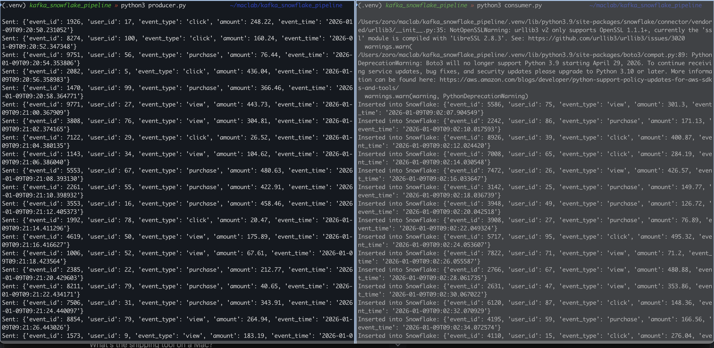
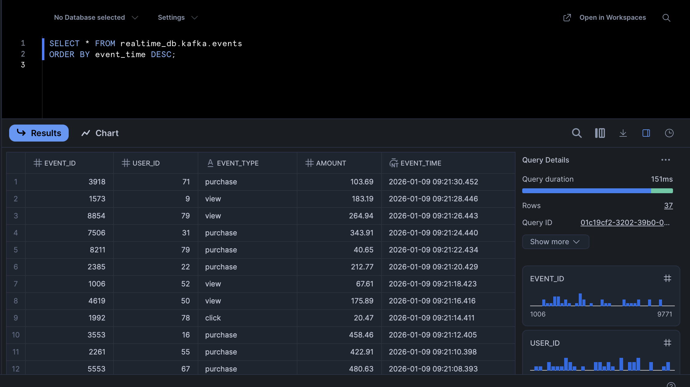

# Real-Time Data Pipeline with Kafka & Snowflake

## Overview
This project demonstrates a **real-time data streaming pipeline** using **Apache Kafka, Python, and Snowflake**.  
Events are produced in real time, stored reliably in Kafka, and consumed by a Python service that loads them into **Snowflake** for analytics.

---

## Sample Output




## Architecture

```
Python Producer → Kafka → Python Consumer → Snowflake
```

---

## Tech Stack
- **Apache Kafka** – Message broker  
- **Python** – Producer & Consumer  
- **Snowflake** – Data warehouse  
- **Docker** – Containerized Kafka setup  

---

## How It Works
1. The **producer** generates JSON events and publishes them to a Kafka topic.  
2. **Kafka** stores events durably and manages message offsets.  
3. The **consumer** reads events from Kafka, validates them, and inserts them into Snowflake.  
4. Data becomes available in Snowflake for **near real-time reporting**.

---

## Setup

### Start Kafka
```bash
docker-compose up -d
```

### Create Kafka Topic
```bash
docker exec -it kafka_snowflake_pipeline-kafka-1 kafka-topics   --create --topic events --bootstrap-server localhost:9092 --partitions 1 --replication-factor 1
```

### Install Python Dependencies
```bash
pip install kafka-python snowflake-connector-python
```

---

## 🏗 Step 4: Create Warehouse, Database, and Table

Run the following in your **Snowflake Worksheet**:

```sql
-- Warehouse
CREATE WAREHOUSE IF NOT EXISTS compute_wh
  WITH WAREHOUSE_SIZE = 'XSMALL'
  AUTO_SUSPEND = 60
  AUTO_RESUME = TRUE;

-- Database & Schema
CREATE DATABASE IF NOT EXISTS realtime_db;
CREATE SCHEMA IF NOT EXISTS realtime_db.kafka;

-- Table
CREATE TABLE IF NOT EXISTS realtime_db.kafka.events (
    event_id INT,
    user_id INT,
    event_type STRING,
    amount FLOAT,
    event_time TIMESTAMP
);
```

---

### Run the Pipeline
```bash
python3 producer.py
python3 consumer.py
```

---

## Verify in Snowflake
```sql
SELECT * FROM realtime_db.kafka.events
ORDER BY event_time DESC;
```

---

## Why Kafka?
Kafka acts as a **reliable mediator** between systems:
- Buffers data during traffic spikes  
- Prevents data loss if consumers fail  
- Supports replay of historical data  
- Enables multiple consumers  
- Decouples producers from consumers  

---

## Resume Summary
**Built a real-time data pipeline using Apache Kafka, Python, and Snowflake to ingest streaming events, validate data, and enable near real-time analytics through a decoupled, fault-tolerant architecture.**
